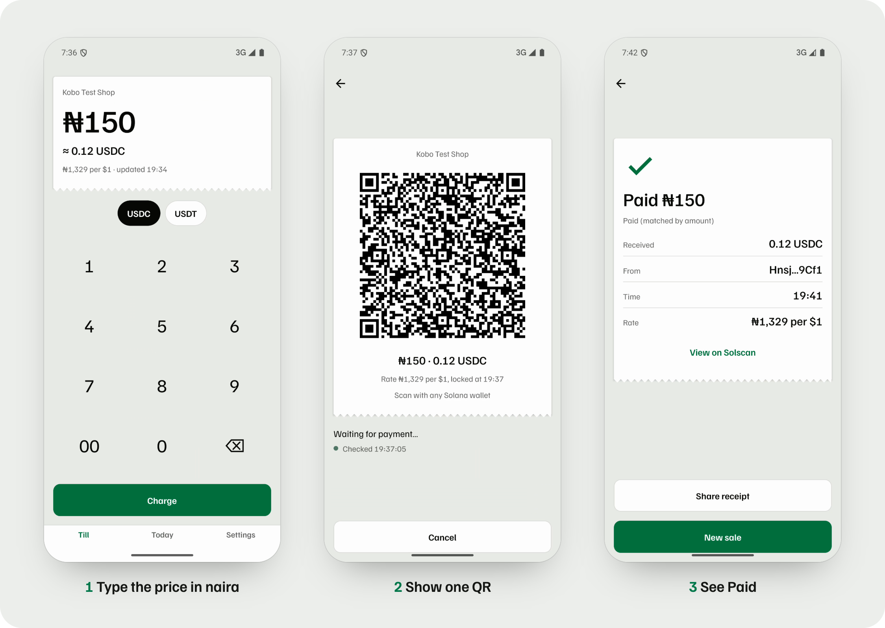
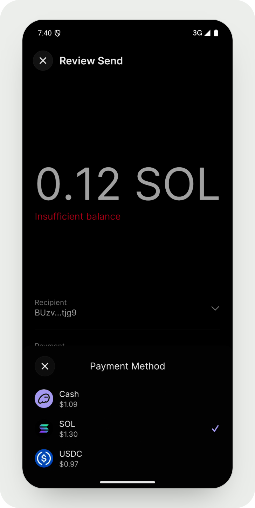
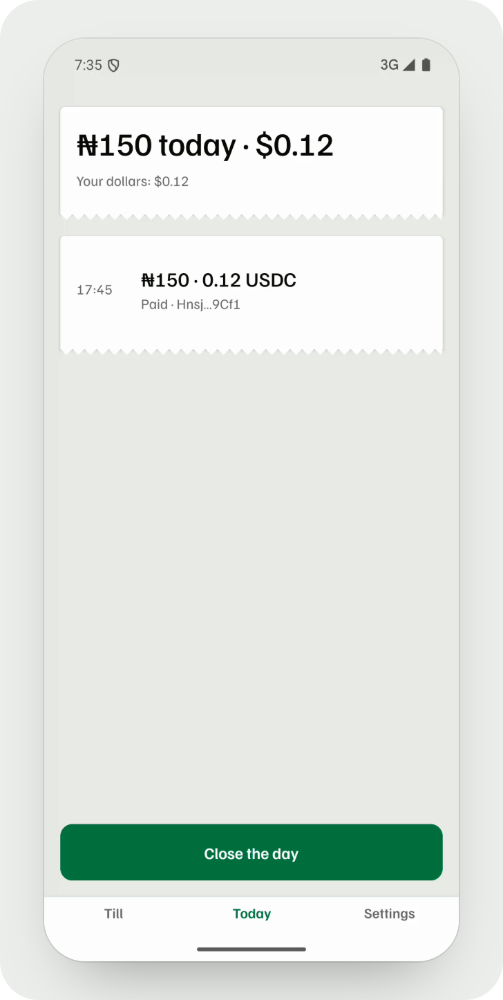
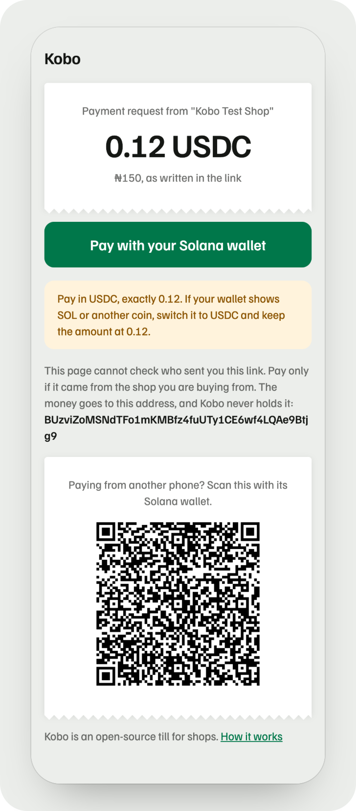
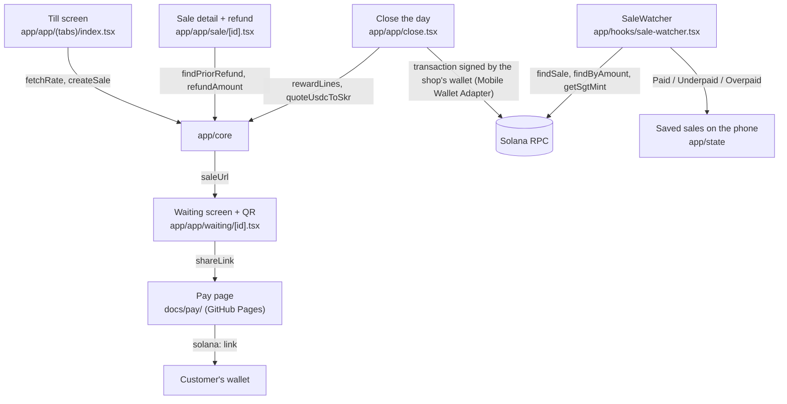

<div align="center">

# Kobo


[](https://github.com/Yonkoo11/kobo-till/actions/workflows/tests.yml)

[](https://yonkoo11.github.io/kobo-till/pay/)

### Get paid in digital dollars.

**Kobo is an Android till for Nigerian shops. The shopkeeper types a naira price, Kobo shows one Solana Pay QR for the matching USDC, and the screen turns to Paid when the payment lands in the shop's own wallet. Two real payments from Phantom on Solana mainnet each showed Paid within seconds of their block.**

**[ Watch the demo ↗ ](assets/media/kobo-demo.mp4)** · **[ Pitch deck ↗ ](assets/media/kobo-deck.pdf)** · **[ Verify it yourself ↗ ](#verify-it-yourself-in-3-minutes)** · **[ The receipt ↗ ](https://solscan.io/tx/4rFCgZJoLApdchHC1rCFD9d9ypLXH9Dpyjy3LMZaHaVdjpRewa8uKETrzcBrzxu5RK5TrZsbnUX1p2VM2WWFRdBx)**

Built for Clock In (Solana Mobile x Radiants).



</div>

---

## ▶ Demo

*A 68-second walk through one real ₦150 sale on Solana mainnet, 2026-10-05: [assets/media/kobo-demo.mp4](assets/media/kobo-demo.mp4). Both phones are Android emulators with Google Play, the shop running Kobo and the customer running Phantom. The shop name is a test name.*

<table>
<tr>
<th width="50%">The customer's side: Phantom opens the request with SOL pre-filled; the payer switches to USDC</th>
<th width="50%">Today's roll: each sale with amount, payer and status, then Close the day</th>
</tr>
<tr>
<td align="center"></td>
<td align="center"></td>
</tr>
</table>

---

## Table of contents
- [The problem](#the-problem)
- [What Kobo is](#what-kobo-is)
- [Selling over WhatsApp or Telegram](#selling-over-whatsapp-or-telegram)
- [Verify it yourself in 3 minutes](#verify-it-yourself-in-3-minutes)
- [The headline result](#the-headline-result)
- [Architecture](#architecture)
- [How a payment is matched](#how-a-payment-is-matched)
- [What's real, and what we deliberately did not claim](#whats-real-and-what-we-deliberately-did-not-claim)
- [Tech stack](#tech-stack)
- [Project layout](#project-layout)
- [Run it locally](#run-it-locally)
- [Tests](#tests)
- [License](#license)

## The problem
- **A shopkeeper can't tell if a crypto payment really arrived.** Today the customer sends USDC to an address pasted into a chat and shows a screenshot. A screenshot can be fake, and checking a wallet by hand for every sale doesn't work behind a counter.
- **The price is in naira, the payment is in dollars.** Someone has to convert at the moment of sale, at a rate both sides can see.
- **A wallet app is not a till.** It has no list of today's sales, no receipt and no refund tied to a sale.

## What Kobo is
A till on the shopkeeper's Android phone that watches Solana for each sale. The loop:

<div align="center">

**`TYPE PRICE → SHOW QR → SEE PAID → CLOSE THE DAY`**

</div>

1. **Type price.** The shopkeeper types naira. Kobo fetches the rate from two public sources (open.er-api.com and CoinGecko), applies the shop's own adjustment and works out the USDC, rounded up to the cent.
2. **Show QR.** A Solana Pay link with the amount, the USDC coin and a fresh one-time reference for this sale. The rate is locked when the QR appears.
3. **See Paid.** Kobo looks for the payment on Solana, reads how much USDC the shop's account actually gained, and prints a receipt: Paid, Underpaid or Overpaid, with a Solscan link. The money goes straight to the shop's own wallet; Kobo holds no key and converts nothing.
4. **Close the day.** Today lists every sale. At close, customers who paid from a Seeker phone are lined up for a small SKR reward, sent in one batch signed by the shop's wallet.

The shop's wallet connects through Mobile Wallet Adapter. For a staff phone, View only mode takes payments into the owner's wallet with no wallet on the phone at all.

## Selling over WhatsApp or Telegram
Many Nigerian shops sell in chats. A buyer's wallet is on the same phone as the chat, so they cannot scan a QR on their own screen, and chat apps only make web links tappable, not `solana:` ones.

<table>
<tr>
<td width="62%" valign="top">

1. On the Waiting screen, **Send payment link** opens Android's share menu with a message and a web link.
2. The link opens a static page, [docs/pay/](docs/pay/), served by GitHub Pages. It shows the amount, a button that opens the buyer's wallet with the payment filled in, and the same QR for paying from another device.
3. The till matches the payment exactly as it does at the counter.

The sale details ride after the `#` in the link, and browsers never send that part to the server, so the page stores and logs nothing. The page accepts only the real USDC and USDT coins and real 32-byte addresses, writes every field as plain text, and says that it cannot check who sent the link.

</td>
<td width="38%" align="center">

</td>
</tr>
</table>

## Verify it yourself in 3 minutes
No wallet, no key and no phone needed. You need Node 26 and an internet connection. Every line below was run on a fresh clone of this repository before it was written here; the expected results are in the comments.

```bash
git clone https://github.com/Yonkoo11/kobo-till && cd kobo-till/app
npm ci                                    # about 2 minutes
npx vitest run                            # → Test Files 6 passed (6), Tests 56 passed (56)
cd .. && ln -s ../app/node_modules probe/node_modules
T=app/node_modules/.bin/tsx

# 1. The QR for a ₦2,000 sale at ₦1,328.57 per dollar, made by the app's own sale code
$T probe/make-sale.ts --naira 2000 --rate 1328.57 --recipient D2ehKLUQApN8ZxcANjwuTJC7bk7BMJn2voofXy17tCrs
# → solana:D2eh…tCrs?amount=1.51&spl-token=EPjFWdd5AufqSSqeM2qN1xzybapC8G4wEGGkZwyTDt1v&reference=<new each run>&label=Kobo%20probe&message=Kobo%20sale

# 2. The Seeker phone check, on Solana mainnet, against the example owner in the Solana Mobile docs
$T probe/sgt.ts --owner D2ehKLUQApN8ZxcANjwuTJC7bk7BMJn2voofXy17tCrs
# → SGT 5mXbkqKz883aufhAsx3p5Z1NcvD2ppZbdTTznM6oUKLj
#   SKR account: no
$T probe/sgt.ts --owner 9WzDXwBbmkg8ZTbNMqUxvQRAyrZzDsGYdLVL9zYtAWWM
# → NO SGT
#   SKR account: no

# 3. The app's payment reading on a real recent USDC transfer on mainnet (a different one each run)
$T probe/real-transfer.ts
# → recipient <address> received <amount> USDC from <address>
#   as a sale expecting that amount: PAID; expecting +0.01: UNDERPAID
#   (or "no simple two-party USDC transfer in the last 25 signatures; rerun": run it again)

# 4. A version 1 transaction (new on mainnet) loads without error
$T probe/v1-check.ts
# → version 1 sig <signature>
#   <address> received <amount> USDC   (or "no USDC receiver in this one")
```

What this proves: the sale maths, the Solana Pay link, the Seeker check and the payment reading are the app's own code (`app/core/`), and they give the right answers on real mainnet data. What it does not prove: a phone wallet paying the QR; that is the mainnet result below. The public Solana network limits how often you can ask; if a check answers `HTTP error (429)`, wait a minute and run it again.

## The headline result
A real ₦150 sale on Solana mainnet, recorded on both phones for the demo:

| | |
|---|---|
| Sale | ₦150 at ₦1,329 per $1, locked at 19:37 (Lagos time): 0.12 USDC |
| Payment | 0.12 USDC from the customer's Phantom to the shop's wallet, block 453662644 at 18:41:53 UTC ([Solscan](https://solscan.io/tx/4rFCgZJoLApdchHC1rCFD9d9ypLXH9Dpyjy3LMZaHaVdjpRewa8uKETrzcBrzxu5RK5TrZsbnUX1p2VM2WWFRdBx)) |
| Till | Its last check before the payment read "Checked 19:41:53"; the next check printed "Paid ₦150 · Paid (matched by amount)" |
| Earlier the same day | A first ₦150 payment went the same way ([Solscan](https://solscan.io/tx/3qhKdCcqSpTGqyasmMx1orDYKziGHw6DhQudS6pde39TEHfZadVVY8ciiQ8tS1bL2s6e6qqSRwawgTs2ndTGFbwa)) |

Both receipts say "matched by amount" because Phantom left the sale's reference out of the transaction; see the table below.

## Architecture


All money logic lives in `app/core/` with no screen code in it, which is why the checks above run it from a laptop.

## How a payment is matched
| Step | Function | Rule |
|---|---|---|
| Find the payment | `findSale` (`core/detect.ts`) | Transactions that carry this sale's one-time reference. A transaction carrying another sale's reference is refused, and a signature already counted for one sale is never counted again. |
| No reference in the payment | `findByAmount` (`core/match-amount.ts`) | For wallets that drop the reference: a payment of exactly the expected amount of the sale's coin into the shop's account, made after the sale started, not already counted. Skipped while two open sales share coin and amount. The receipt says "matched by amount". |
| Measure it | `balanceDelta` | What the shop's account gained in that transaction, from the balances before and after. What the sender says is ignored. |
| Small amounts | `DUST` | Under 0.01 USDC is ignored. Several part payments for one sale are added up. |
| Decide | `classify` | Exact is Paid, short is Underpaid (the screen says how much is missing), more is Overpaid. |
| Refund | `findPriorRefund` | Before a refund, Kobo checks Solana for an earlier refund of the same sale, so a sale can't be refunded twice. |
| Seeker reward | `getSgtMint`, `rewardLines` | One reward per Seeker Genesis Token per day, on the price not on any overpayment, never paid twice for the same token and day. |

## What's real, and what we deliberately did not claim
| Capability | Status |
|---|---|
| **A real wallet paying a Kobo QR on mainnet** | Real, twice (2026-10-05, Phantom, Android emulators with Google Play). Paid on the till's next check after the block. |
| **Naira price to USDC QR** | Real. Unit tests, the mainnet check above, and the on-screen QR decoded to the expected link. |
| **Reading real mainnet payments** | Real, including version 1 transactions (supported since 2026-10-04 after a check failed on one). |
| **Seeker phone check** | Real on mainnet against the Solana Mobile docs' example owner. |
| **Payment link and pay page** | Real. The page is live and rebuilds exactly the QR's Solana Pay link (16 tests). A first Telegram test cut the link at a space in the shop name; the name now travels in link-safe characters, not yet re-sent through Telegram. |
| Phantom and the reference | Measured negative. When the link reached Phantom through Android's open-link path, Phantom pre-filled SOL, dropped the USDC coin and the reference; the payer switched to USDC by hand. Kobo matched by exact amount. Phantom's camera scanner is not yet tested. |
| The tap from a phone browser into a wallet | Not yet tested. |
| Running on a physical Android phone | Not yet. Every run so far is on Android emulators (Google Play image, arm64). |
| Underpaid, part payments, refund maths | Run on a local Solana network only. |
| Refunds and Seeker rewards signed by a real wallet | Not done. |
| Solflare and the Seeker wallet | Not yet tested. |
| Tap to pay (NFC) | Not built. |
| Wallet identity check | Phantom shows "identity could not be verified" when the shop connects: the identity file must sit at the site's root domain, which a project page cannot serve. |
| A Kobo-made exchange rate | Not claimed. Kobo shows public rates and the shop's own adjustment; it never sets a rate, holds money or converts it. |
| Legal status in Nigeria | Not claimed. Whether non-custodial till software needs a licence under the Investments and Securities Act 2025 is a question for a lawyer. |
| Shop demand | Not claimed yet. No numbers here until conversations with shops exist. |
| Customers with the right wallet | Not assumed. Africa's largest stablecoin wallet, MiniPay, runs on Celo, not Solana. A Kobo QR needs USDC on Solana: Phantom, Solflare or the Seeker wallet. |

## Tech stack
- **App:** Expo 57, React Native 0.86, expo-router, TypeScript · **Wallet:** Mobile Wallet Adapter (`@wallet-ui/react-native-kit`) · **Solana:** `@solana/kit` 7.1.1, Solana Pay transfer requests · **Pay page:** static HTML and JavaScript on GitHub Pages · **Tests:** 56 (Vitest), in CI · **Type:** Familjen Grotesk

## Project layout
```
app/
  app/            # screens: till, waiting, today, sale detail, close the day, settings, shop QR, cash out, welcome, setup
  core/           # money logic, no screen code: sale + QR link, payment link, rate, payment detection, refunds, rewards, Seeker check
  hooks/          # SaleWatcher (watches Solana for every open sale), rate, balance, wallet
  state/          # sales and shop settings saved on the phone
  ui/             # theme tokens, receipt slip, buttons, copy
  e2e/            # emulator test with a test wallet
docs/pay/         # the pay page behind a shared payment link (GitHub Pages)
probe/            # scripts that run app/core against mainnet or a local network (the checks above)
assets/readme/    # the pictures on this page, built by scripts/readme-images.cjs from the mainnet recordings
assets/media/     # the demo video and the pitch deck
brand/final/      # the app icon set
deck/             # the pitch deck source (node deck/build.cjs)
video/            # the demo video source (Remotion)
build-apk.sh      # builds the Android release app
DESIGN_SYSTEM.md  # colours, type, the receipt slip, motion
```

## Run it locally
```bash
cd app && npm ci                 # install
npx vitest run                   # tests
cd .. && ./build-apk.sh          # Android release app (needs Java 17 and the Android SDK)
```
An optional private RPC URL goes in `app/.env` (see `app/.env.example`). For a test build against a local Solana network, set `EXPO_PUBLIC_KOBO_TEST_RPC` and `EXPO_PUBLIC_KOBO_TEST_USDC` before building; that build shows "Test network: not real money".

## Tests
```bash
cd app && npx vitest run         # → Tests 56 passed (56)
```
34 of the 56 are Kobo's own: 18 for the money logic (naira to coin rounding, the Solana Pay link, payment measurement, Paid/Underpaid/Overpaid, the rate adjustment, Seeker rewards) and 16 for the payment link and pay page (same link as the QR, refused coins and addresses, hidden characters in shop names). The rest come from the app template. They run on every push in [CI](.github/workflows/tests.yml).

## License
Apache 2.0 ([LICENSE](LICENSE)). Kobo stores sales only on the shop's phone; it has no server.
