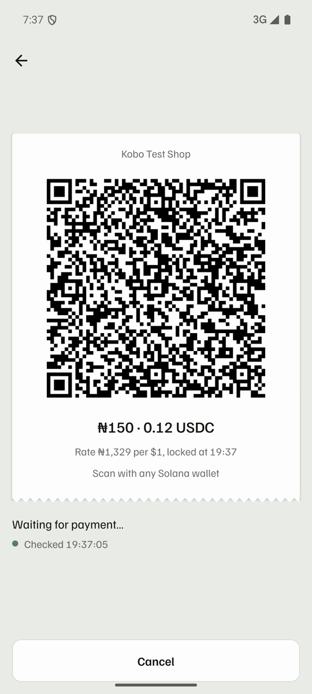
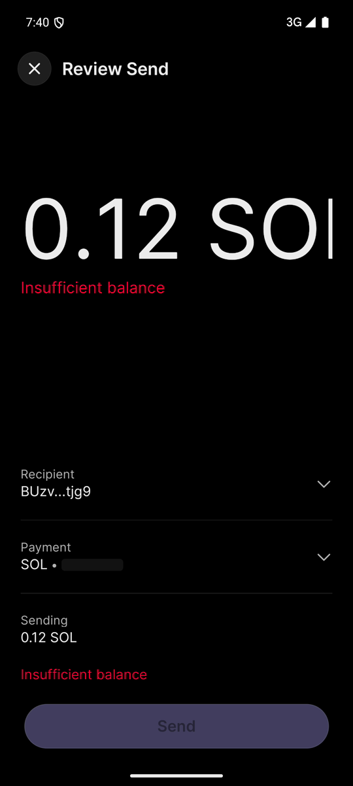
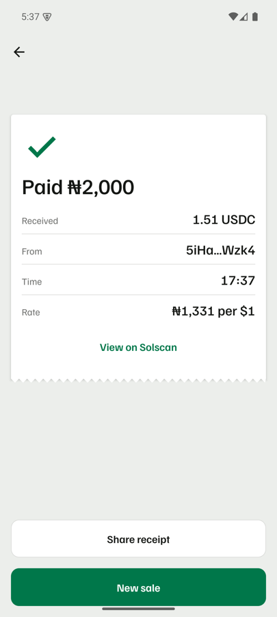
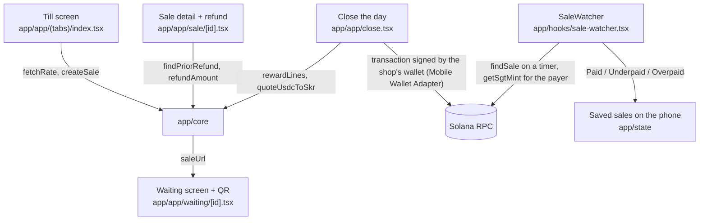

<div align="center">

# Kobo


[](https://github.com/Yonkoo11/kobo-till/actions/workflows/tests.yml)


### Get paid in digital dollars.

**Kobo is an Android till for Nigerian shops. The shopkeeper types a naira price, Kobo shows a Solana Pay QR for the matching USDC, and the screen turns to "Paid" when the payment lands on Solana. On a test phone the Paid receipt was on screen 5 seconds after the customer's payment.**

**[ Verify it yourself ↗ ](#verify-it-yourself-in-3-minutes)** · **[ What's real ↗ ](#whats-real-and-what-we-deliberately-did-not-claim)**

Built for Clock In (Solana Mobile x Radiants).

</div>

---

## ▶ Demo

*One real ₦150 sale on Solana mainnet, 2026-10-05, on two Android emulators with Google Play: Kobo on the shop phone, Phantom on the customer's ([transaction](https://solscan.io/tx/4rFCgZJoLApdchHC1rCFD9d9ypLXH9Dpyjy3LMZaHaVdjpRewa8uKETrzcBrzxu5RK5TrZsbnUX1p2VM2WWFRdBx)). The shop name is a test name.*

| The sale waiting: ₦150 is 0.12 USDC at ₦1,329 per $1, locked at 19:37 | The customer opens the link in Phantom, which pre-fills 0.12 SOL; the payer switches the coin to USDC before sending | The Paid receipt: 0.12 USDC received from Hnsj…9Cf1 at 19:41, "Paid (matched by amount)" because Phantom left out the reference |
|---|---|---|
|  |  |  |

A 68-second demo video of this sale is rendered; its link goes here once it is uploaded.

---

## Table of contents
- [The problem](#the-problem)
- [What Kobo is](#what-kobo-is)
- [Verify it yourself in 3 minutes](#verify-it-yourself-in-3-minutes)
- [The headline result](#the-headline-result)
- [Architecture](#architecture)
- [How a payment is matched](#how-a-payment-is-matched)
- [What's real, and what we deliberately did not claim](#whats-real-and-what-we-deliberately-did-not-claim)
- [Tech stack](#tech-stack)
- [Project layout](#project-layout)
- [Run it locally](#run-it-locally)
- [Tests](#tests)
- [License](#license)

## The problem
- **A shopkeeper can't tell if a crypto payment really arrived.** Today the customer sends USDC to an address and shows a screenshot. A screenshot can be fake, and checking a wallet by hand for every sale doesn't work behind a counter.
- **The price is in naira, the payment is in dollars.** Someone has to do the conversion at the moment of sale, at a rate both sides can see.
- **A wallet app is not a till.** It has no list of today's sales, no receipt and no refund tied to a sale.

## What Kobo is
A till on the shopkeeper's Android phone that watches Solana for each sale. The loop:

<div align="center">

**`TYPE PRICE → SHOW QR → SEE PAID → CLOSE THE DAY`**

</div>

1. **Type price.** The shopkeeper types naira. Kobo fetches the naira rate from two public sources (open.er-api.com and CoinGecko), applies the shop's own adjustment and works out the USDC amount, rounded up to the cent.
2. **Show QR.** Kobo makes a Solana Pay link with the amount, the USDC coin and a fresh one-time reference key for this sale, and shows it as a QR for the customer's Solana wallet. Phantom is the only wallet tested so far. For a customer who is not at the counter, **Send payment link** shares the same request as a web link (WhatsApp makes https links tappable, not `solana:` ones). The link opens a static page, [docs/pay/](docs/pay/), with a button that opens the customer's wallet and the QR for paying from another phone. The sale details ride after the `#`, which browsers never send to the server.
3. **See Paid.** Kobo asks Solana for transactions that carry that reference, reads how much USDC the shop's account actually gained, and shows Paid, Underpaid or Overpaid. Some wallets drop the reference (Phantom did in both real payments so far); then Kobo looks for a payment of exactly the sale's amount and coin into the shop's account after the sale started, and marks the receipt "matched by amount". It never does this while two open sales share the same amount. The money goes straight to the shop's own wallet; Kobo never holds it.
4. **Close the day.** Today lists every sale. At close, customers who paid from a Seeker phone can be sent a small SKR reward in one batch, signed by the shop's wallet.

## Verify it yourself in 3 minutes
No wallet, no key and no phone needed. You need Node 26 and an internet connection. Every line below was run on a fresh copy of this repository before it was written here; the expected results are in the comments.

```bash
git clone https://github.com/Yonkoo11/kobo-till && cd kobo-till/app
npm ci                                    # about 2 minutes
npx vitest run                            # → Test Files 5 passed (5), Tests 40 passed (40)
cd .. && ln -s ../app/node_modules probe/node_modules
T=app/node_modules/.bin/tsx

# 1. The QR for a ₦2,000 sale at ₦1,328.57 per dollar, made by the app's own sale code
$T probe/make-sale.ts --naira 2000 --rate 1328.57 --recipient D2ehKLUQApN8ZxcANjwuTJC7bk7BMJn2voofXy17tCrs
# → solana:D2eh…tCrs?amount=1.51&spl-token=EPjFWdd5AufqSSqeM2qN1xzybapC8G4wEGGkZwyTDt1v&reference=<new each run>&label=Kobo%20probe&message=Kobo%20sale

# 2. The Seeker phone check, on Solana mainnet, against the example owner in the Solana Mobile docs
$T probe/sgt.ts --owner D2ehKLUQApN8ZxcANjwuTJC7bk7BMJn2voofXy17tCrs
# → SGT 5mXbkqKz883aufhAsx3p5Z1NcvD2ppZbdTTznM6oUKLj
$T probe/sgt.ts --owner 9WzDXwBbmkg8ZTbNMqUxvQRAyrZzDsGYdLVL9zYtAWWM
# → NO SGT

# 3. The app's payment reading on a real recent USDC transfer on mainnet (a different one each run)
$T probe/real-transfer.ts
# → recipient <address> received <amount> USDC from <address>
#   as a sale expecting that amount: PAID; expecting +0.01: UNDERPAID
#   (or "no simple two-party USDC transfer in the last 25 signatures; rerun": run it again)

# 4. A version 1 transaction (new on mainnet) loads without error
$T probe/v1-check.ts
# → version 1 sig <signature>
#   <address> received <amount> USDC   (or "no USDC receiver in this one")
```

What this proves: the sale maths, the Solana Pay link, the Seeker check and the payment reading are the app's own code (`app/core/`), and they give the right answers on real mainnet data. What it does not prove: that a phone wallet like Phantom pays a Kobo QR correctly. That needs two real phones and is the next test (see the table below). The public Solana network limits how often you can ask; if a check answers `HTTP error (429)`, wait a minute and run it again.

## The headline result
A full sale on an Android emulator, test build of Kobo, local Solana network. The customer is a script (`probe/pay.ts`) that pays the link decoded from the on-screen QR:

```
12:26:31  customer payment confirmed on the local network (1.51 USDC, with the sale's reference)
12:26:36  phone shows "Paid ₦2,000 · 1.51 USDC"
```

5 seconds from payment to Paid. A later run with the new look is in the stills above: Waiting checked Solana at 17:36:41, and the Paid receipt shows the payment time as 17:37.

## Architecture


All money logic lives in `app/core/` and has no screen code in it, which is why the probes above can run it from a laptop.

## How a payment is matched
| Step | Function | Rule |
|---|---|---|
| Find the payment | `findSale` (`core/detect.ts`) | Transactions that carry this sale's one-time reference. A transaction carrying another sale's reference is refused, and a signature already counted for one sale is never counted again. |
| No reference in the payment | `findByAmount` (`core/match-amount.ts`) | Fallback for wallets that drop the reference: a payment of exactly the expected amount of the sale's coin into the shop's account, made after the sale started, not already counted. Skipped while two open sales share coin and amount. The receipt says "matched by amount". |
| Measure it | `balanceDelta` | What the shop's USDC account gained in that transaction, from the balances before and after. What the sender says is ignored. |
| Small amounts | `DUST` | Under 0.01 USDC is ignored. Several part payments for one sale are added up. |
| Decide | `classify` | Exact is Paid, short is Underpaid (the screen says how much is missing), more is Overpaid. |
| Refund | `findPriorRefund` | Before a refund, Kobo checks Solana for an earlier refund of the same sale, so a sale can't be refunded twice. |
| Seeker reward | `getSgtMint`, `rewardLines` | One reward per Seeker Genesis Token per day, on the price not on any overpayment, never paid twice for the same token and day. |

## What's real, and what we deliberately did not claim
| Capability | Status |
|---|---|
| **Naira price to USDC QR** | Real. Unit tests plus the mainnet check above; QR on the emulator decoded to the expected Solana Pay link. |
| **Paid detection** | Real on mainnet: the two Phantom payments below showed Paid within seconds of their block. Underpaid, dust-then-paid and two part payments were run on a local Solana network. |
| **Reading real mainnet payments** | Real. The app's code read a real USDC transfer on mainnet as PAID, and as UNDERPAID when one cent more was expected. |
| **Version 1 transactions** | Fixed on 2026-10-04 after the mainnet check above failed on one. Before that, a payment sent as a version 1 transaction would have stayed on Waiting. After the fix, the app's code read a real version 1 mainnet transaction: 0.19999 USDC received. |
| **Seeker phone check** | Real on mainnet against the Solana Mobile docs' example owner. |
| Sending a payment link | Built and unit-tested (the page rebuilds exactly the QR's Solana Pay link and refuses unknown coins, anything that is not a 32-byte address, and test-build links; it strips direction and invisible characters from the shop name). The page says it cannot check who sent the link and shows the full address being paid. The page renders at phone width and its QR decodes. Not live until the site is published, and the tap from a phone browser into a wallet is untested. |
| Running on a physical Android phone | Not yet. Every run so far is on Android emulators (Google Play image, arm64). The release APK is a standard arm64 build; it has not been installed on a physical phone. |
| A real wallet paying a Kobo QR on mainnet | Done twice, 2026-10-05, Phantom on two Android emulators with Google Play: ₦150 → 0.12 USDC landed in the shop wallet each time and Kobo showed Paid within seconds ([first](https://solscan.io/tx/3qhKdCcqSpTGqyasmMx1orDYKziGHw6DhQudS6pde39TEHfZadVVY8ciiQ8tS1bL2s6e6qqSRwawgTs2ndTGFbwa), [second](https://solscan.io/tx/4rFCgZJoLApdchHC1rCFD9d9ypLXH9Dpyjy3LMZaHaVdjpRewa8uKETrzcBrzxu5RK5TrZsbnUX1p2VM2WWFRdBx), recorded for the demo)). With a caveat: when the link reached Phantom through Android's open-link path, Phantom pre-filled a send of 0.12 **SOL** and dropped the USDC coin; the payer picked USDC by hand and retyped 0.12, and the one-time reference was not in the transaction, so Kobo matched the sale by amount (its fallback) rather than by reference. The second payment went the same way. Phantom's own in-app scanner, Solflare and the Seeker wallet are not yet tested. |
| Refund and Seeker rewards signed by a real wallet | Not done. The refund maths and the double-refund check ran on the local network; signing with a real wallet needs the real-phone test. |
| SKR swap for rewards (Jupiter) | Built, not run. Jupiter only works on mainnet. |
| Tap to pay (NFC) | Not built. |
| A Kobo-made exchange rate | Not claimed. Kobo shows public rates and the shop's own adjustment; it never sets a rate, holds money or converts it. |
| Legal status in Nigeria | Not claimed. Whether non-custodial till software needs a licence under Nigeria's Investments and Securities Act 2025 is an open question for a lawyer. |
| Shop demand | Not claimed yet. Conversations with shops are being logged; no numbers here until they exist. |
| Customers with the right wallet | Not assumed. The stablecoin wallet with the biggest African footprint, MiniPay, runs on Celo, not Solana. A Kobo QR needs USDC on Solana: Phantom, Solflare or the Seeker wallet. |

## Tech stack
- **App:** Expo 57, React Native 0.86, expo-router, TypeScript · **Wallet:** Mobile Wallet Adapter through `@wallet-ui/react-native-kit` · **Solana:** `@solana/kit` 7.1.1, Solana Pay transfer requests · **Tests:** 40 (Vitest), in CI · **Font:** Familjen Grotesk

## Project layout
```
app/
  app/          # screens: till, waiting, today, sale detail, close the day, settings, shop QR, cash out, welcome, setup
  core/         # money logic, no screen code: sale + QR link, rate, payment detection, refund check, rewards, Seeker check, Jupiter
  hooks/        # SaleWatcher (polls Solana for open sales), rate, balance, wallet
  state/        # sales and shop settings saved on the phone
  ui/           # theme tokens, receipt slip, buttons, copy
  e2e/          # emulator test with the fake wallet
probe/          # scripts that run app/core against mainnet or a local network (the checks above, plus pay.ts for test payments)
docs/stills/    # the three screenshots above
build-apk.sh    # builds the Android release app
```

## Run it locally
```bash
cd app && npm ci                 # install
npx vitest run                   # tests
./../build-apk.sh                # Android release app (needs Java 17 and the Android SDK; about 12 minutes)
```
For a test build against a local Solana network, set `EXPO_PUBLIC_KOBO_TEST_RPC` and `EXPO_PUBLIC_KOBO_TEST_USDC` (a test coin you created) before building. The test build has its own app name and shows "Test network: not real money".

## Tests
```bash
cd app && npx vitest run         # → Tests 40 passed (40)
```
18 of the 40 test the money logic: naira to coin rounding, the Solana Pay link, payment measurement, Paid/Underpaid/Overpaid, the rate adjustment and the Seeker reward rules. The rest come from the app template and check the wallet and network wiring. They run on every save in [CI](.github/workflows/tests.yml).

## License
Apache 2.0 ([LICENSE](LICENSE)). Kobo stores sales only on the shop's phone; it has no server.
